# Entity Relationship Diagram (ERD)

This document contains the Entity Relationship Diagram for the application's database models, formulated according to standard relational database design patterns.

```mermaid
erDiagram
    %% Core Entities
    User ||--o{ Application : "submits"
    User ||--o{ Ticket : "holds"
    User ||--o{ Interest : "expresses"
    User ||--o{ Contract : "signs"
    User ||--o{ Invoice : "receives"
    User ||--o{ Notification : "receives"
    
    %% LMS Credentials & Psychometrics
    User ||--o| LmsCredential : "has"
    User ||--o{ PsychometricAttempt : "attempts"
    User ||--o{ Enrollment : "enrolls in"
    User ||--o{ ExamAttempt : "takes"
    User ||--o{ Certificate : "earns"

    %% Job System
    JobCategory ||--o{ JobListing : "categorizes"
    JobListing ||--o{ Application : "receives"
    
    %% Job <-> TicketCatalog Many-to-Many
    JobListing }o--o{ TicketCatalog : "requires"

    %% Application Workflow
    Application ||--o{ JobStage : "progresses through"
    Application ||--o{ Nomination : "receives"
    Application ||--o{ Contract : "generates"
    Application ||--o{ Ticket : "requires"
    
    %% Invoicing and Billing
    Invoice ||--o| Receipt : "paid by"

    %% LMS System
    CertificationType ||--o{ Course : "grants"
    CertificationType ||--o{ Certificate : "awarded as"
    Course ||--o{ CourseModule : "contains"
    Course ||--o| ExamConfig : "configured by"
    Course ||--o{ ExamQuestion : "tests with"
    Course ||--o{ Enrollment : "has"
    Course ||--o{ ExamAttempt : "has"

    %% Detailed Schema
    Application {
        int id PK
        int userId FK
        int jobId FK
        int currentStageId FK
        datetime createdAt
        datetime updatedAt
        string status
        string visaSponsorshipStatus
        json User
        json JobListing
        json JobStages
    }

    BankAccount {
        int id PK
        string bankName
        string accountNumber
        string accountName
        string accountHolderName
        string accountType
        string routingCode
        string currency
        boolean isActive
        boolean isDefault
        datetime createdAt
        datetime updatedAt
    }

    Certificate {
        string id PK
        string userId FK
        string certificationTypeId FK
        datetime issueDate
        datetime expiryDate
        datetime createdAt
        datetime updatedAt
    }

    CertificationType {
        string id PK
        string name
        string code
        datetime createdAt
        datetime updatedAt
    }

    Contract {
        int id PK
        int applicationId FK
        int userId FK
        string company
        string role
        string status
        string documentUrl
        string documentUrl1
        string documentUrl15
        string adminDocumentUrl
        boolean avelingWelcomeSent
        datetime createdAt
        datetime updatedAt
        string Application
        string User
    }

    Course {
        string id PK
        string title
        string code
        string description
        string format
        string certificationTypeId FK
        int price
        int capacity
        boolean isPublished
        datetime createdAt
        datetime updatedAt
    }

    CourseModule {
        string id PK
        string courseId FK
        string title
        string contentType
        string contentUrl
        string content
        int durationMinutes
        int sequenceOrder
        datetime createdAt
        datetime updatedAt
    }

    Enrollment {
        string id PK
        string userId FK
        string courseId FK
        string status
        string paymentStatus
        int theoryProgress
        datetime createdAt
        datetime updatedAt
    }

    ExamAttempt {
        string id PK
        string userId FK
        string courseId FK
        int score
        boolean isPass
        int attemptNumber
        datetime createdAt
        datetime updatedAt
    }

    ExamConfig {
        string courseId FK
        int passThreshold
        int timeLimitMinutes
        datetime createdAt
        datetime updatedAt
    }

    ExamQuestion {
        string id PK
        string courseId FK
        string questionText
        string questionType
        json options
        int correctOptionIndex
        string correctAnswer
        int weight
        datetime createdAt
        datetime updatedAt
    }

    Interest {
        int id PK
        int userId FK
        json roles
        json skills
        json qualifications
        json experience
        datetime createdAt
        datetime updatedAt
    }

    Invoice {
        int id PK
        int applicantId FK
        string purpose
        int amountInUSD
        datetime date
        datetime receiptProofSubmission
        boolean isPaid
        datetime createdAt
        datetime updatedAt
    }

    JobCategory {
        int id PK
        string name
        string description
        datetime createdAt
        datetime updatedAt
    }

    JobListing {
        int id PK
        string title
        string description
        string location
        string employmentType
        string requirements
        int categoryId FK
        string company
        boolean visaSponsorship
        boolean isActive
        string salary
        string jobType
        json ticketIds
        json stages
        string benefits
        datetime createdAt
        datetime updatedAt
    }

    JobStage {
        int id PK
        int applicationId FK
        string name
        string status
        boolean isCurrent
        json Application
    }

    LmsCredential {
        string id PK
        string userId FK
        string lmsUsername
        string passwordHash
        boolean isActive
        datetime createdAt
        datetime updatedAt
    }

    Nomination {
        int id PK
        int applicationId FK
        string tradeStream
        string hostEmployer
        string vacancies
        string competitors
        boolean isSelected
        string documentUrl
        string adminDocumentUrl
        datetime createdAt
        datetime updatedAt
        string Application
    }

    Notification {
        int id PK
        int userId FK
        string subject
        string message
        boolean isRead
        string type
        datetime createdAt
        datetime updatedAt
    }

    PsychometricAttempt {
        int id PK
        int userId FK
        string module
        int score
        boolean passed
        string answers
        datetime createdAt
        datetime updatedAt
    }

    Receipt {
        int id PK
        int invoiceId FK
        int amountPaid
        datetime createdAt
        datetime updatedAt
    }

    Ticket {
        int id PK
        int userId FK
        int applicationId FK
        string status
        string ticketNumber
        string ticketType
        string description
        int purchasePrice
        datetime purchaseDate
        datetime expiryDate
        string proof
        string proofThumbnail
        datetime sponsorshipDeadline
        int ticketSponsorshipRefundAmount
        string refundStatus
        string courseId FK
        boolean canApplySponsorship
        int realPrice
        int subsidisedPrice
        string receiptUrl
        string receiptReference
        string paymentStatus
        boolean courseAccessGranted
        int ticketSequenceNumber
        datetime createdAt
        datetime updatedAt
        json User
        json Application
    }

    TicketCatalog {
        int id PK
        string name
        int normalPrice
        string description
        datetime createdAt
        datetime updatedAt
    }

    User {
        int id PK
        string fullName
        string email
        string passwordHash
        string role
        boolean isVerified
        string cvUrl
        string verificationToken
        string resetPasswordToken
        datetime resetPasswordExpires
        string phoneNumber
        datetime dateOfBirth
        string gender
        string nationality
        string address
        string city
        string state
        string country
        string countryOfResidence
        string zipCode
        string candidateNumber
        int walletBalance
        string bankName
        string accountNumber
        string accountName
        string avelingUsername
        string avelingPassword
        boolean psychometricModule1Passed
        boolean psychometricModule2Passed
        datetime psychometricCompletedAt
        boolean depositPaid
        datetime depositPaidAt
        boolean fullBalancePaid
        datetime createdAt
        datetime updatedAt
    }
```

