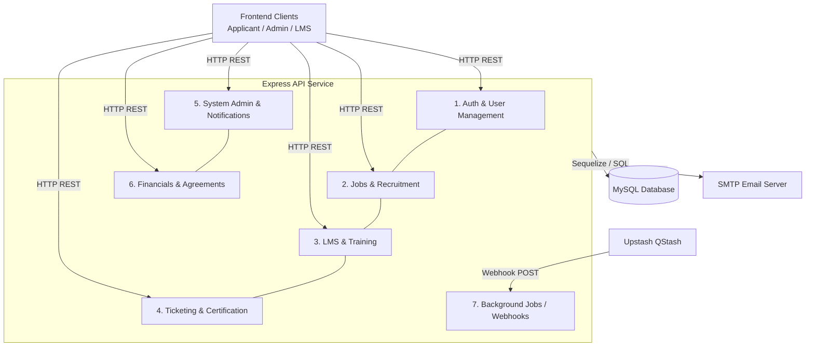

# 03 - High Level Design (HLD)

## 1. Exposed Entry Points

### 1. Auth & User Management
- **HTTP Routes:**
  - `POST /api/auth/register`, `POST /api/auth/register-admin`
  - `POST /api/auth/login`, `POST /api/auth/refresh`, `POST /api/auth/logout`
  - `GET /api/auth/me`, `PUT /api/auth/profile`, `PUT /api/auth/change-password`
  - `GET /api/auth/verify-email`, `POST /api/auth/forgot-password`, `POST /api/auth/reset-password`, `POST /api/auth/resend-verification`
  - `POST /api/lms-auth/login`
  - `GET /api/lms-credentials/applicants/:applicantId` (Admin)
  - `POST /api/lms-credentials/generate` (Admin)

### 2. Jobs & Recruitment Pipeline
- **HTTP Routes:**
  - `GET /api/jobs`, `GET /api/jobs/:id`
  - `GET /api/dashboard`
  - `POST /api/applications`, `GET /api/applications`, `GET /api/applications/:id`
  - `POST /api/applications/:id/advance`, `POST /api/applications/:id/visa-sponsorship`
  - `GET /api/cv`, `POST /api/cv`, `PUT /api/cv`, `DELETE /api/cv`
  - `GET /api/psychometric/status`, `GET /api/psychometric/module/:module/questions`, `POST /api/psychometric/module/:module/submit`
  - `POST /api/interests`, `PUT /api/interests/me`, `GET /api/interests/me`

### 3. LMS & Training (Aveling)
- **HTTP Routes:**
  - `GET /api/courses`, `GET /api/courses/:id`, `GET /api/courses/certifications/lookup`
  - `POST /api/courses`, `GET /api/courses/admin/all`, `PATCH /api/courses/:id/publish`, `POST /api/courses/bulk-import`
  - `GET /api/courses/:id/modules`, `POST /api/courses/:id/modules`, `PUT /api/courses/:id/modules/:moduleId`, `DELETE /api/courses/:id/modules/:moduleId`
  - `GET /api/exams/courses/:courseId/question-bank`, `POST /api/exams/courses/:courseId/questions`, `PUT /api/exams/questions/:questionId`, `DELETE /api/exams/questions/:questionId`
  - `PUT /api/exams/courses/:courseId/settings`
  - `GET /api/exams/attempts/:attemptId`, `POST /api/exams/attempts/start`, `POST /api/exams/attempts/:attemptId/answers`, `POST /api/exams/attempts/:attemptId/submit`, `GET /api/exams/attempts/:attemptId/result`

### 4. Ticketing, Certifications & Sponsorship
- **HTTP Routes:**
  - `GET /api/tickets`, `GET /api/tickets/:id`, `POST /api/tickets`, `PUT /api/tickets/:id`
  - `POST /api/tickets/:id/apply-sponsorship`, `POST /api/tickets/:id/request-retake`
  - `POST /api/tickets/:id/refund-choice`, `POST /api/tickets/:id/pay-aveling`
  - `POST /api/tickets/:id/exam-outcome`, `POST /api/tickets/:id/set-review-awaiting`
  - `POST /api/tickets/apply-batch-sponsorship`
  - `POST /api/tickets/:id/submit-receipt`
  - `GET /api/certificates/learner/me`, `POST /api/certificates/issue`
  - `GET /api/ticket-catalogs`, `POST /api/admin/ticket-catalogs`, `PUT /api/admin/ticket-catalogs/:id`, `DELETE /api/admin/ticket-catalogs/:id`

### 5. System Admin & Notifications
- **HTTP Routes:**
  - `GET /health`, `GET /health/crons`, `GET /api/admin/health`
  - `GET /api/notifications`, `PUT /api/notifications/mark-all-read`, `PUT /api/notifications/:id/read`
  - `GET /api/admin/applications`, `GET /api/admin/applications/drafts`, `GET /api/admin/applications/:id`
  - `POST /api/admin/applications/:id/stages`, `GET /api/admin/applications/:id/stages/:stageId`, `PUT /api/admin/applications/:id/stages/:stageId`, `DELETE /api/admin/applications/:id/stages/:stageId`
  - `POST /api/admin/applications/:id/stages/:stageId/complete`, `POST /api/admin/applications/:id/complete`, `DELETE /api/admin/applications/:id`
  - `PUT /api/admin/applications/:id/visa-sponsorship`
  - `POST /api/admin/mail`
  - `GET /api/admin/jobs/stats`, `GET /api/admin/jobs`, `GET /api/admin/jobs/:id`, `POST /api/admin/jobs`, `PUT /api/admin/jobs/:id`, `DELETE /api/admin/jobs/:id`
  - `GET /api/admin/users`, `GET /api/admin/users/:id`, `DELETE /api/admin/users/:id`
  - `POST /api/admin/users/:id/welcome-mail`, `POST /api/admin/users/:id/eoi-mail`
  - `PUT /api/admin/users/:id/wallet`, `PUT /api/admin/users/:id/aveling-credentials`, `PUT /api/admin/users/:id/subsidy-percentage`, `PUT /api/admin/applicants/:id/aveling-credentials`
  - `GET /api/admin/interests`, `DELETE /api/admin/interests/:id`, `POST /api/admin/interests/:id/approve`
  - `GET /api/admin/psychometric/attempts`, `POST /api/admin/psychometric/attempts/:id/approve`, `POST /api/admin/psychometric/attempts/:id/reject`
  - `POST /api/admin/seed`

### 6. Financials & Agreements
- **HTTP Routes:**
  - `GET /api/admin/finance/configs`, `GET /api/admin/bank-accounts`, `GET /api/bank-accounts`, `GET /api/admin/bank-accounts/:id`, `GET /api/admin/finance/bank-accounts/by-amount`, `POST /api/admin/bank-accounts`, `PUT /api/admin/bank-accounts/:id`, `DELETE /api/admin/bank-accounts/:id`
  - `GET /api/admin/applications/:id/contracts`, `POST /api/admin/applications/:id/contracts`
  - `GET /api/applications/:id/contracts`, `POST /api/applications/contracts/documents`, `PUT /api/applications/:id/contracts/:contractId/accept`, `PUT /api/applications/:id/contracts/:contractId/reject`
  - `POST /api/admin/applications/:id/nominations`, `GET /api/admin/applications/:id/nominations`, `POST /api/applications/documents`, `GET /api/applications/:id/nominations`
  - `GET /api/admin/users/:userId/wallet-statement`, `POST /api/admin/users/:userId/verify-deposit`, `POST /api/admin/users/:userId/verify-full-balance`
  - `GET /api/admin/users/:userId/payment-milestone`, `GET /api/payment-milestone`
  - `POST /api/admin/users/:userId/assign-all-tickets`, `POST /api/admin/users/:userId/approve-package-invoice`, `POST /api/admin/users/:userId/update-payment-status`
  - `POST /api/admin/invoices/dispatch`, `GET /api/admin/invoices`, `POST /api/admin/invoices/:id/receipt`

### 7. Background Jobs (Cron)
- **HTTP Routes (Upstash QStash Webhooks):**
  - `POST /api/cron/application`
  - `POST /api/cron/nomination`
  - `POST /api/cron/contract`
  - `POST /api/cron/sponsorship`
  - `POST /api/cron/aveling`
  - `POST /api/cron/psychometric`

## 2. External Dependencies & Interfaces

### External Interfaces Exposed by this Service:
1. **Express REST API:** The core HTTP/JSON interface exposed to frontend applications (Applicant Portal, Admin Dashboard, Aveling LMS UI).
2. **QStash Webhook Consumers:** Specific `POST` routes strictly used as consumers for QStash scheduled messages (triggering cron processing).

### External Systems Depended On:
1. **MySQL Database (via Sequelize ORM):** Persistent relational data storage.
2. **SMTP Email Provider (via Nodemailer):** Sending emails (welcome, verification, invoices, results).
3. **Upstash QStash:** Used as an external trigger for executing scheduled tasks (cron jobs).
4. **Filesystem (Local/Docker):** Temporary or persistent storage for uploads (`multer` is used, and a `/uploads` static route exists).

## 3. Architecture Diagram

## 4. Structural Observations
1. **Webhooks instead of internal cron loop:** The "Cron" jobs are actually exposed as HTTP POST webhooks (`/api/cron/*`), secured via QStash signature verification. They do not run a continuous local `setInterval`/`node-cron` loop but rely on an external scheduler pushing to them.
2. **Cross-Component Bleed:** Financial operations (Invoices, Receipts, Contracts, Milestones) are scattered across `TicketController`, `ApplicationController`, and `AdminController`. There is no dedicated `FinanceController` despite having clear financial concepts in the database models.
3. **Double Static Routing:** In `app.ts`, `express.static` is mapped twice for `/uploads` pointing to two potentially different or overlapping paths (`../public/uploads` and `../uploads`).
